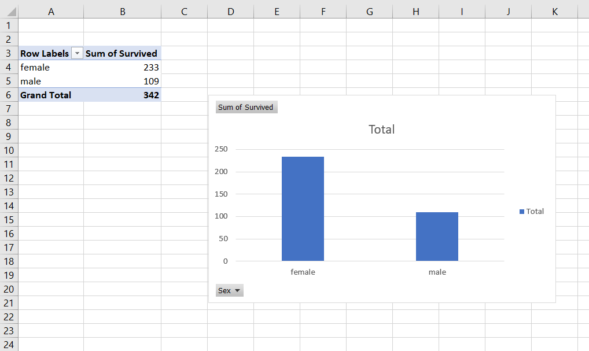
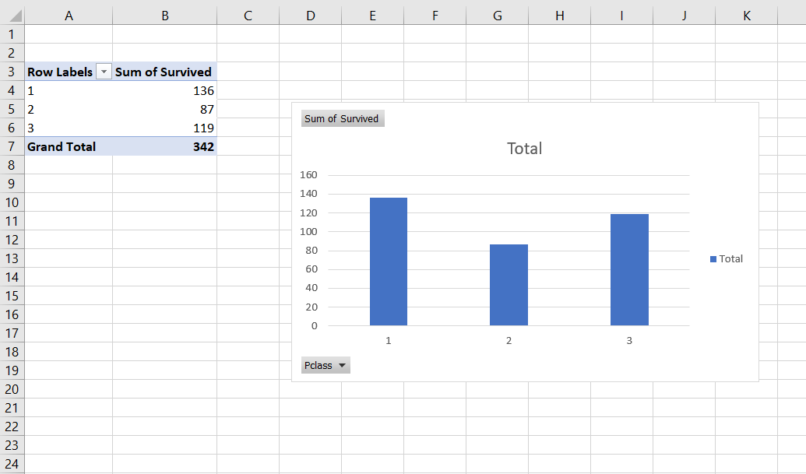
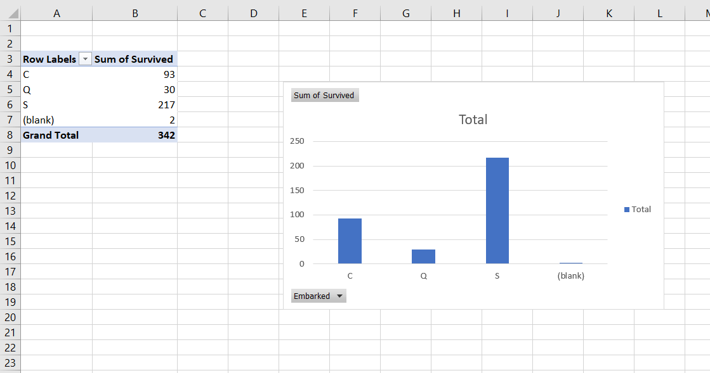

# SCT_DS_2
# 📊 Task 2 – Data Cleaning & Exploratory Data Analysis (EDA) on Titanic Dataset

As part of my **Data Science Internship at SkillCraft Technology**, I performed data cleaning and exploratory data analysis (EDA) on the famous Titanic dataset from Kaggle.

This task focused on identifying missing values, understanding the relationships between variables, and uncovering patterns and trends in the survival data.

---

## 📁 Dataset Used
- [Titanic Dataset – Kaggle](https://www.kaggle.com/competitions/titanic/data)
- File analyzed: `train.csv`

---

## 🧼 Data Cleaning Summary
- Handled missing values in key columns:
  - `Age`: Missing values identified and filtered
  - `Embarked`: 2 missing entries handled
  - `Cabin`: Large number of blanks — excluded from analysis
- Cleaned data used for clear and meaningful visualizations

---

## 📊 Charts & Insights

### 📌 Chart 1 – Survival by Gender

- **Variables**: `Sex` vs `Survived`
- **Insight**: Females had a significantly higher survival rate  
  🟢 *Pattern*: “Women and children first” protocol

---

### 📌 Chart 2 – Survival by Passenger Class

- **Variables**: `Pclass` vs `Survived`
- **Insight**: 1st Class passengers had the highest survival rate  
  🟢 *Trend*: Wealthier passengers had better access to rescue

---

### 📌 Chart 3 – Survival by Embarkation Port

- **Variables**: `Embarked` vs `Survived`
- **Insight**: Passengers from Cherbourg showed better survival outcomes  
  🟢 *Possibility*: More first-class passengers boarded at Cherbourg

---

## 🛠 Tools Used
- Microsoft Excel
- Pivot Tables
- 2D Column Charts

---

## 📝 Key Takeaways
- Practiced real-world data cleaning techniques
- Explored meaningful relationships between survival and factors like gender, class, and embarkation port
- Identified trends and patterns visually through pivot charts

---

## 📂 Project Files
- [`Titanic_Task2_.xlsx`](./Titanic_Task2_.xlsx)

---

## 📢 Hashtags
#SkillCraft #DataScienceInternship #TitanicEDA #ExcelAnalysis #PivotCharts #InternshipTasks #Task2Complete

